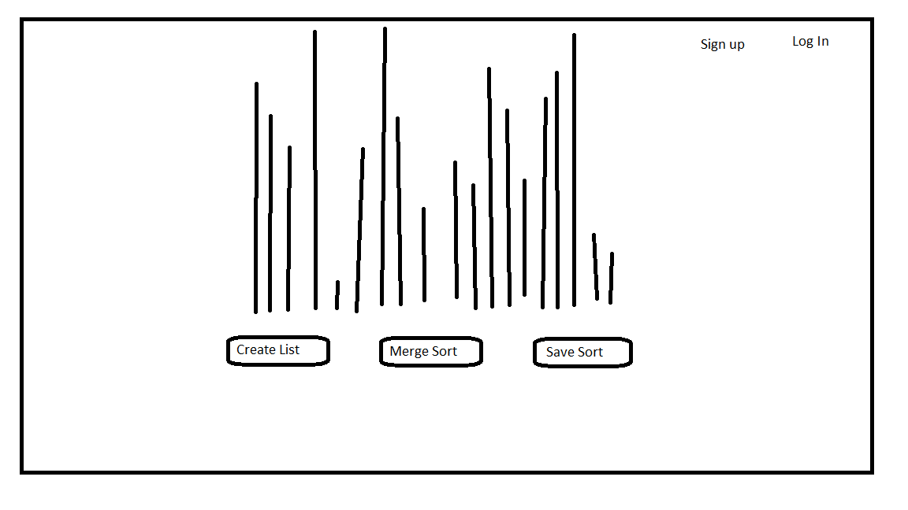
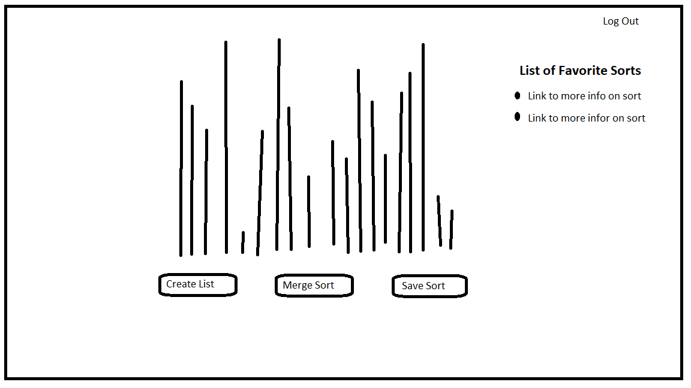

## Sorting Aligrathim Visualizer APP
Live Link: https://algo-views-client.herokuapp.com

**The Goal of the APP**
Our goal is to make a app that will visualize the merge sort. Once this goal has been achieved we plan to add additional recognisable sorts.

The first stage of the app will allow the user to load an arry and then sort with buttons also a button will be used to re-load the array

#### JavaScript Frameworks
**Make Up**
The front end of this app will be React.js.
Backend has not been decided yet as this will be majority front end code
The Backend will save a user and password, and once signed in a user can favorite a sort, or even a list they liked.
Later version a user could import a list to be sorted

#### Visualization of the webpage
**Front Page**

**Signed In Page**

#### Installation Instructions
**Fork and clone this repo**
**Install npm globally on your computer**
**Run `npm i` inside the '/client' folder**